# The Worst way to code "Hello World"

Inspired by a project seen on "[I review your stupid code](https://www.youtube.com/watch?v=NCoeDOVUJqk)" by Samuel Miller

> `helloWorld.py` starts guessing the first letter untill it gets the corrent one and then onto the next letter until it completes the message

